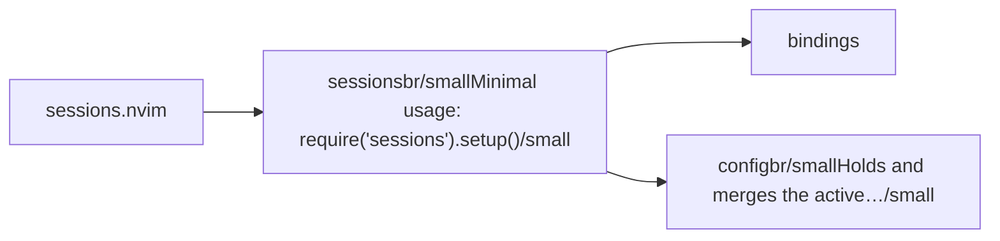
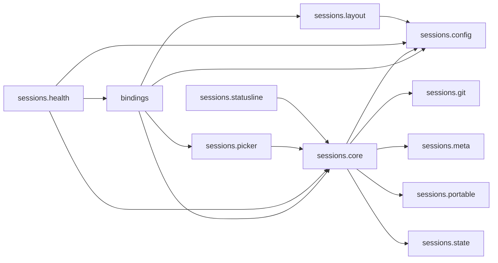

# sessions.nvim — module map

> **Generated** by `documentation`. Do not edit by hand — run `:DocMap`
> (or `nvim --headless -l scripts/gen_map.lua`) to regenerate.

**6 modules** · 2 namespaces · 10 helper files

The [interactive map](index.html) has filtering, full descriptions and
source links; this page is the version the code host renders directly.

## Namespaces

## Dependencies

Which parts of the tree require which, rolled up to the second level.
The [interactive map](index.html)'s **Deps** view has this per module,
in both directions, with load-time and lazy requires told apart.

## Modules

| Module | Description | Fns | Docs |
|---|---|---|---|
| `sessions` | Minimal usage: require("sessions").setup() | 9 | [src](../../lua/sessions/init.lua) |
| &nbsp;&nbsp;`bindings` |  |  |  |
| &nbsp;&nbsp;&nbsp;&nbsp;`sessions.bindings.autocmds` | Also wires the structural dirty-tracking autocmds (BufAdd/BufDelete/...) that back `sessions.core.mark_dirty()` for the statusline component. | 4 | [src](../../lua/sessions/bindings/autocmds/init.lua) |
| &nbsp;&nbsp;&nbsp;&nbsp;`sessions.bindings.keymaps` | Disabled unless `setup({ keymaps = { ... | 1 | [src](../../lua/sessions/bindings/keymaps/init.lua) |
| &nbsp;&nbsp;&nbsp;&nbsp;`sessions.bindings.usercmds` | Registers :Session <subcommand>, one verb built via lib.nvim's composer (:Verb sub … + <Tab> completion + Markdown docgen), plus a standalone :LastSession… | 7 | [src](../../lua/sessions/bindings/usercmds/init.lua) |
| &nbsp;&nbsp;&nbsp;&nbsp;`sessions.bindings.which_key` | which-key is a **soft** dependency: if it is not installed this is a no-op. | 2 | [src](../../lua/sessions/bindings/which_key/init.lua) |
| &nbsp;&nbsp;`sessions.config` | Holds and merges the active `Sessions.Config`, applied by `M.setup()` on top of `sessions.config.DEFAULTS`. | 2 | [src](../../lua/sessions/config/init.lua) |

## Drift

1 errors · 1 warnings · 9 info

| Severity | Check | Message |
|---|---|---|
| error | `module-path-mismatch` | lua/sessions/config/DEFAULTS.lua declares @module 'sessions.DEFAULTS' but lives at 'sessions.config.DEFAULTS' |
| warn | `require-not-declared` | requires "sessions.config.DEFAULTS" (line 11), which no file in this tree declares |

9 informational findings

| Check | Message |
|---|---|
| `missing-readme` | lua/sessions has no README.md |
| `missing-readme` | lua/sessions/bindings/autocmds has no README.md |
| `missing-readme` | lua/sessions/bindings/keymaps has no README.md |
| `missing-readme` | lua/sessions/bindings/usercmds has no README.md |
| `missing-readme` | lua/sessions/bindings/which_key has no README.md |
| `missing-readme` | lua/sessions/config has no README.md |
| `unreferenced-module` | sessions.DEFAULTS is required by no other file in the tree |
| `unreferenced-module` | sessions.health is required by no other file in the tree |
| `unreferenced-module` | sessions.statusline is required by no other file in the tree |

